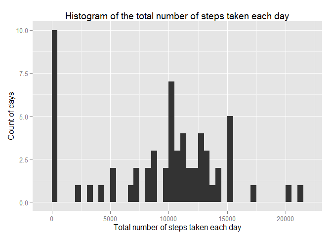
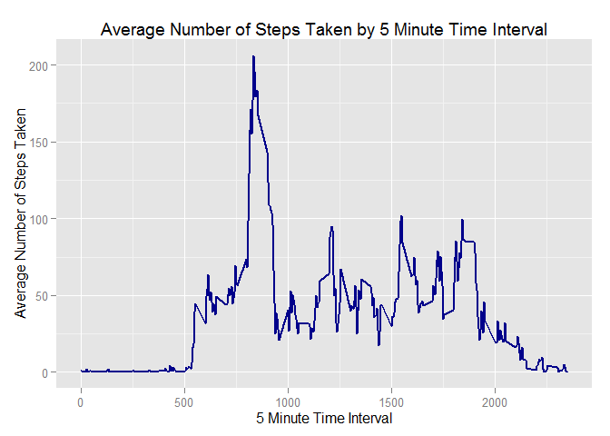
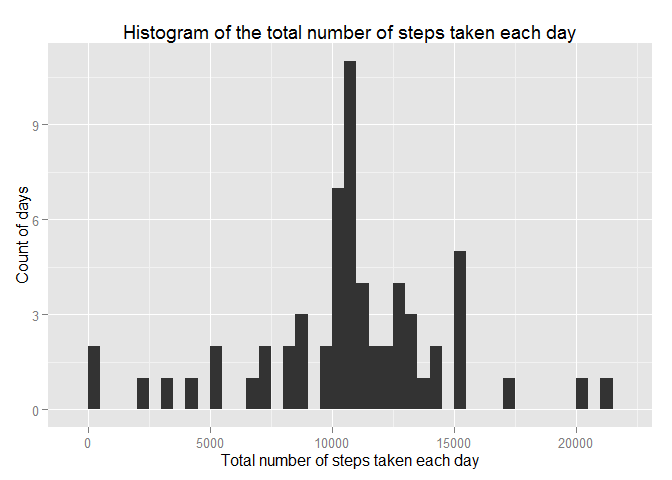
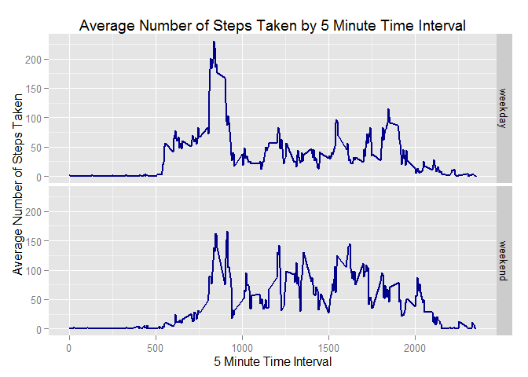

# Reproducible Research: Peer Assessment 1
Rohan Jagdish Ashar  
August 16, 2015  

## Loading and preprocessing the data


```r
setwd("C:/Users/rohan/Documents/coursera/git/RepData_PeerAssessment1")
unzip(zipfile = "activity.zip")

# Load the data (i.e. read.csv())
rawData <- read.csv("activity.csv")
```

## What is mean total number of steps taken per day?


```r
# Calculate the total number of steps taken per day
stepsPerDay <- tapply(rawData$steps, rawData$date, FUN = sum, na.rm = TRUE)

# Make a histogram of the total number of steps taken each day
library(ggplot2)
histSteps <- qplot(stepsPerDay, binwidth = 500, geom = "histogram",
       main = "Histogram of the total number of steps taken each day",
       xlab = "Total number of steps taken each day",
       ylab = "Count of days")
histSteps
```

 

```r
# Calculate and report the mean and median of the total number of steps taken per day
mean(stepsPerDay, na.rm=TRUE)
```

```
## [1] 9354.23
```

```r
median(stepsPerDay, na.rm=TRUE)
```

```
## [1] 10395
```


## What is the average daily activity pattern?


```r
# Make a time series plot (i.e. type = "l") of the 5-minute interval (x-axis) and the average number of steps taken, averaged across all days   (y-axis)
avgStepsByInterval <- aggregate(x = list(avgSteps = rawData$steps),
       by = list(interval = rawData$interval), FUN = mean, na.rm = TRUE)
timeSeries <- ggplot(data = avgStepsByInterval,
       aes(x = interval, y = avgSteps))
timeSeries <- timeSeries + geom_line(colour = "darkblue", size = 1)
timeSeries <- timeSeries + ggtitle("Average Number of Steps Taken by 5 Minute Time Interval")
timeSeries <- timeSeries + xlab("5 Minute Time Interval")
timeSeries <- timeSeries + ylab("Average Number of Steps Taken")
timeSeries
```

 

```r
# Which 5-minute interval, on average across all the days in the dataset, contains the maximum number of steps?
maxRow <- which.max(avgStepsByInterval$avgSteps)
timeMaxSteps <- avgStepsByInterval[maxRow, ]
timeMaxSteps
```

```
##     interval avgSteps
## 104      835 206.1698
```

## Imputing missing values


```r
# Calculate and report the total number of missing values in the dataset (i.e. the total number of rows with NAs)
sum(is.na(rawData))
```

```
## [1] 2304
```

```r
# Create a new dataset that is equal to the original dataset but with the missing data filled in.
imputData <- rawData 

# Devise a strategy for filling in all of the missing values in the dataset. I am going to use the mean for that 5-minute interval (calculated above) to fill up missing values.
for (i in 1:nrow(imputData)) {
       if (is.na(imputData$steps[i])) {
               imputData$steps[i] <-  avgStepsByInterval[which(imputData$interval[i] == avgStepsByInterval$interval), ]$avgSteps
    }
}
sum(is.na(imputData))
```

```
## [1] 0
```

```r
# Make a histogram of the total number of steps taken each day and Calculate and report the mean and median total number of steps taken per day.
stepsPerDay <- tapply(imputData$steps, imputData$date, FUN = sum, na.rm = TRUE)
histSteps <- qplot(stepsPerDay, binwidth = 500, geom = "histogram",
       main = "Histogram of the total number of steps taken each day",
       xlab = "Total number of steps taken each day",
       ylab = "Count of days")
histSteps
```

 

```r
mean(stepsPerDay, na.rm=TRUE)
```

```
## [1] 10766.19
```

```r
median(stepsPerDay, na.rm=TRUE)
```

```
## [1] 10766.19
```

Do these values differ from the estimates from the first part of the assignment?
What is the impact of imputing missing data on the estimates of the total daily number of steps?

**Replacing NA with mean / median did not affect most of the dataset. Since it did affect
those days where 0 steps were recorded both the mean and median increased slightly.**
 
## Are there differences in activity patterns between weekdays and weekends?

**Yes, there are differences between weekdays and weekends. The early morning activity seems to be much higher on the weekday slowing down between 10:00 am and 6:00 pm. While the weekend activity isn't as high between 8:00 am and 9:00 am, it is higher than the weekday activity from 11:00 am to 4:00 pm.**


```r
# Create a new factor variable in the dataset with two levels - "weekday" and "weekend" indicating whether a given date is a weekday or weekend day.

imputData$DayofWeek <- factor(format(as.Date(imputData$date), "%A"))
levels(imputData$DayofWeek) <- list(weekday = c("Monday", "Tuesday",
       "Wednesday","Thursday", "Friday"),weekend = c("Saturday", "Sunday"))

# Make a panel plot containing a time series plot (i.e. type = "l") of the 5-minute interval (x-axis) and the average number of steps taken, averaged across all weekday days or weekend days (y-axis).

avgStepsByInterval <- aggregate(steps ~ interval + DayofWeek, data = imputData, mean)

dayOfWeekTimeSeries <- ggplot(avgStepsByInterval, aes(interval, steps))
dayOfWeekTimeSeries <- dayOfWeekTimeSeries + geom_line(colour = "darkblue", size = 1)
dayOfWeekTimeSeries <- dayOfWeekTimeSeries + facet_grid(DayofWeek ~ .)
dayOfWeekTimeSeries <- dayOfWeekTimeSeries + ggtitle("Average Number of Steps Taken by 5 Minute Time Interval")
dayOfWeekTimeSeries <- dayOfWeekTimeSeries + xlab("5 Minute Time Interval")
dayOfWeekTimeSeries <- dayOfWeekTimeSeries + ylab("Average Number of Steps Taken")
dayOfWeekTimeSeries
```

 
